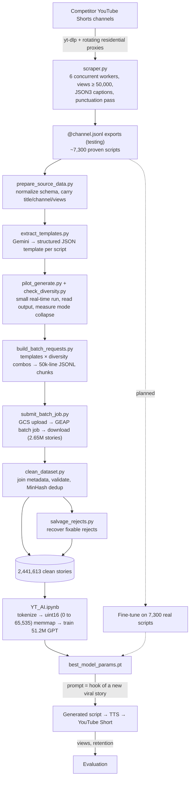
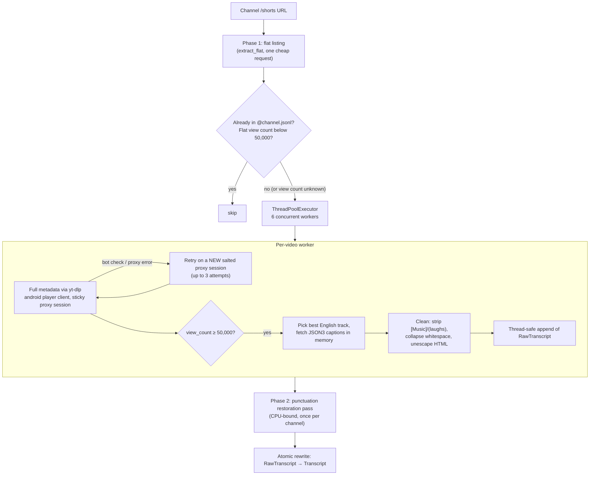
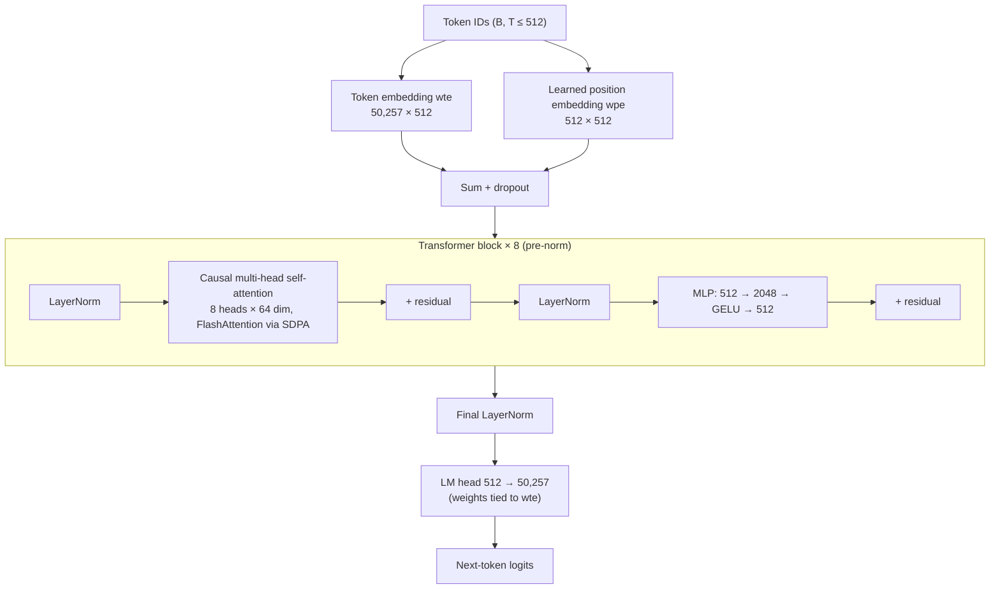
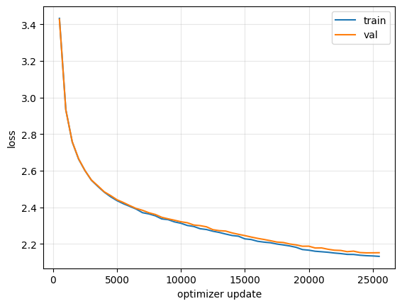

# YT-AI: A 51M-Parameter Story Model Trained From Scratch to Write Viral YouTube Shorts

<a href="https://colab.research.google.com/github/parthdabhi5195/YT-AI/blob/main/stage3-model/YT_AI.ipynb" target="_parent"></a>

YT-AI is an end-to-end machine learning system that learns the ***structure*** of proven, high-view short-form stories and writes new ones with the same plot skeleton but entirely different characters, settings, and events. It covers the full lifecycle of a language model: a proxy-backed YouTube data scraper, a fault-tolerant synthetic data pipeline that produced **2,441,613 valid training stories** through Gemini Enterprise Agent Platform (GEAP) batch prediction, and a **51.2M-parameter decoder-only transformer** written from scratch in PyTorch and pre-trained on **838.6M tokens** to a validation loss of **2.152**.

| | |
|---|---|
| **Model** | GPT-style decoder-only transformer, 8 layers × 8 heads × 512 dim, 512-token context, **51,213,824 parameters** |
| **Pre-training data** | 2,441,613 synthetic stories (~280 words each) generated from ~7,300 real proven scripts |
| **Tokens** | 838,638,935 train / 8,464,873 validation (GPT-2 BPE) |
| **Training** | 2 epochs, 25,593 optimizer updates, bf16 mixed precision, **2.44 hours** on a single Colab GPU |
| **Result** | Validation loss 3.427 → **2.152** (perplexity ≈ 8.6), train/val gap ≈ 0.02 (no overfitting) |
| **Stack** | PyTorch, tiktoken, Hugging Face `datasets`, Google Enterprise Agent AI (Gemini 2.5 Flash-Lite, batch prediction), Google Cloud Storage, yt-dlp, datasketch (MinHash LSH), sentence-transformers |

---

## Table of Contents

1. [Why I Built This](#1-why-i-built-this)
2. [The Core Idea: Clone the Structure, Not the Story](#2-the-core-idea-clone-the-structure-not-the-story)
3. [System Overview](#3-system-overview)
4. [Stage 1 — YouTube Scraping](#4-stage-1--youtube-scraping)
5. [Stage 2 — Synthetic Training Data Pipeline](#5-stage-2--synthetic-training-data-pipeline)
6. [Stage 3 — Decoder-Only Transformer](#6-stage-3--decoder-only-transformer)
7. [Results](#7-results)
8. [How the Model Will Be Used: Hook-Conditioned Generation](#8-how-the-model-will-be-used-hook-conditioned-generation)
9. [Evaluation Plan: Real YouTube Performance](#9-evaluation-plan-real-youtube-performance)
10. [Roadmap](#10-roadmap)
11. [Reproducing the Pipeline](#11-reproducing-the-pipeline)
12. [Lessons Learned](#12-lessons-learned)

---

## 1. Why I Built This

I run a YouTube Shorts automation channel. The workflow is: write an AI-generated Reddit-style story, run it through a text-to-speech agent, and assemble it into a narrated Short with background footage. The channel can produce viral videos (which I define as **more than 50,000 views**), but it did so inconsistently, and for a long time I didn't know why some videos took off and others didn't.

The pattern I eventually found was simple and repeatable: **when I wrote a story modeled on a story that had already gone viral on a competitor's channel, my video usually went viral too.** The audience wasn't responding to the specific characters or the specific setting. They were responding to the underlying *shape* of the story: the kind of hook in the first sentence, the type of secret or betrayal driving the conflict, the order the reveals happen in, and the emotional payoff at the end.

That turned a creative problem into a machine learning problem. If virality lives in structure, then the ideal tool takes a proven transcript as input and outputs a story with the **same structure and plot pattern** but **different characters, settings, and storyline**. General-purpose LLMs can do a version of this when prompted, but they drift toward the same stock names, the same phrasing, and the same generic "AI voice," and every call costs money at scale. I wanted a small model I own, that runs locally, and that has absorbed the house style of this exact genre.

### Inspiration: TinyStories

The project is directly inspired by **TinyStories** (Eldan & Li, 2023), which showed that very small language models (millions to tens of millions of parameters) can write fluent, coherent stories when they're trained on a large, narrow, high-quality synthetic dataset generated by a bigger model. What I took from TinyStories was its workflow:

1. Define a narrow target distribution (for them: simple children's stories; for me: ~280-word narrated drama stories).
2. Use a large LLM to generate millions of examples of that distribution.
3. Inject controlled randomness (vocabulary words and features for them; settings, relationships, incident seeds, and names for me) so the dataset doesn't collapse onto a few repeated stories.
4. Train a small transformer from scratch on the result.

My twist is that the synthetic data is **grounded in real-world performance**. Every one of the 2.44M training stories is derived from a structural template extracted from a real script that already proved itself with an audience of at least 50,000 viewers.

### Goals

* Train a **~50M-parameter model from scratch** (not a fine-tuned API model), sized to fit a free or cheap Colab GPU budget.
* Generate **~2,440,000 synthetic stories** of roughly 280 words each, grounded in **~7,300 proven competitor scripts**.
* Later, **fine-tune** the pre-trained model directly on those ~7,300 real scripts so its voice matches the proven material even more closely.
* Validate the whole thing the only way that actually matters for this business: by **publishing videos and measuring their real view performance**.

---

## 2. The Core Idea: Cloning the Structure, Not the Story

The central design decision in the whole project is separating a story into two layers:

| Structural layer (kept) | Surface layer (replaced) |
|---|---|
| Genre trope ("hidden paternity", "financial betrayal") | Character names |
| Character roles by relationship ("antagonist (mother)") | Setting and location |
| The central secret or stakes, stated abstractly | The specific incident |
| Six ordered plot beats | Occupations, objects, institutions |
| Emotional arc ("sympathy → frustration → vindication") | Dialogue and phrasing |
| Hook technique, narrative voice, POV and tense | |

The pipeline extracts the structural layer from each proven script into a JSON template, then rebuilds the surface layer from scratch using randomized "diversity combos." This does two things at once. It keeps the parts that correlate with virality, and it guarantees the generated stories are **original works rather than paraphrases** of someone else's script: names, places, incidents, and phrasing from the source never make it into a template in the first place (see the "transplant test" in [Section 5.4](#54-stage-21--structural-template-extraction)).

---

## 3. System Overview



The three major stages are:

1. **YouTube scraping**: collect proven scripts (transcripts of Shorts with at least 50,000 views) from competitor channels.
2. **Synthetic training data**: turn ~7,300 proven scripts into 2.44M new, structurally faithful, surface-diverse stories.
3. **Decoder-only transformer**: pre-train a 51.2M-parameter GPT from scratch on those stories, then use it to create original stories using hooks from new viral stories.

---

## 4. Stage 1 — YouTube Scraping

**File:** `stage1-scraping/scraper.py` (final version; earlier iterations are summarized in [Section 4.3](#43-how-the-scraper-evolved))

The scraper walks the Shorts tab of each target channel, keeps only videos that crossed the viral threshold, and saves a clean, punctuated transcript for each one. The final version is a concurrent, proxy-backed, interrupt-safe pipeline that splits network-bound and CPU-bound work into separate phases.

### 4.1 Architecture



Each saved record contains `VideoID`, `Channel`, `Title`, `Duration`, `Views`, and `Transcript`.

### 4.2 Design Decisions and Optimizations

**Two-phase extraction with a cheap pre-filter.** Listing a channel with `extract_flat=True` returns every video ID in a single request without loading per-video pages. Videos that were already scraped are skipped, and so are videos whose flat listing already reports fewer than 50,000 views. Only entries whose flat view count is **missing** fall through to the full per-video check. This avoids paying for the heavy, multi-request `extract_info()` call on videos that were never going to qualify, while still catching videos the flat listing can't report on. Every candidate is then re-checked against the accurate view count in the full metadata.

**Concurrency with a thread pool.** Scraping is dominated by network latency, so videos are processed by a `ThreadPoolExecutor` with `MAX_WORKERS = 6`. Each worker uses its own proxy session, so the worker count is bounded by the proxy plan's concurrent-connection limit rather than by the machine. Writes to the shared JSONL file go through a `threading.Lock`, so rows from different threads can never interleave into a corrupted line. Log lines include the thread name, and each saved video logs how long metadata extraction and caption fetching took separately, which makes it easy to see which step is slowing a run down.

**Separating CPU work from network work.** Earlier versions ran the punctuation-restoration model inline, once per video. Model inference is CPU-bound, so every video blocked on it while network requests sat idle, and the two kinds of work never overlapped. In the final version, workers store only a `RawTranscript`, and a separate `restore_punctuation_pass` runs once per channel after scraping finishes. The pass is **idempotent** (it only touches records that still have `RawTranscript` and no `Transcript`) and writes through a temporary file swapped in with `os.replace`, so a crash mid-pass can't corrupt the dataset.

**One lightweight player client.** By default yt-dlp queries several YouTube player clients per video (web, mweb, iOS, Android, TV) to cover gaps in format availability. The scraper only needs metadata and a caption URL, so it pins the extractor to the `android` client, which cuts the number of requests per video and has historically not required a PO token for captions the way the `web` client increasingly does. The code documents the trade-off (Android can occasionally return empty automatic captions) and the fallback if the no-transcript rate rises.

**Sticky proxy sessions with salted retries.** The scraper runs through a rotating residential proxy (Webshare.io). If a video's metadata request and caption request come from two different IPs, signed caption URLs can fail, so `sticky_proxy_for(video_id, attempt)` hashes the video ID with MD5 into a numeric session ID that pins all of one video's requests to one exit IP. The `attempt` number is salted into the hash. Without that salt, the session was a pure function of the video ID: a video that drew a YouTube-flagged IP once would draw the **same** flagged IP on every retry and on every future run, because a failed video is never written to the output and so gets retried forever with the identical doomed session.

**Error classification before retrying.** `_is_retryable_extraction_error` decides whether a fresh exit IP could plausibly help:

| Error | Action | Why |
|---|---|---|
| "Sign in to confirm you're not a bot" | Retry on a new session | IP-reputation challenge; a different IP often clears it |
| Bad gateway, tunnel failure, proxy error | Retry on a new session | Proxy-side hiccup |
| "Confirm your age" | Fail immediately | Account-level gate on the video; no IP change will fix it |
| Anything else | Fail immediately and log | Not worth spending retries on |

**Bounded hangs and clean shutdown.** `SOCKET_TIMEOUT = 15` caps every yt-dlp network call. Without it, one stuck request could block a worker thread indefinitely, and because Python threads can't be killed from outside, Ctrl+C couldn't stop the script until that call finished on its own. On a keyboard interrupt, the pool is shut down with `cancel_futures=True`. All candidates are submitted up front, so at any moment most of them (potentially around 1,000 videos) are still queued rather than running. Cancelling the queue means shutdown only waits for the handful of in-flight requests, bounded by the socket timeout, instead of working through the entire backlog. Everything already saved stays intact, and re-running resumes where it stopped.

**In-memory JSON3 captions.** Instead of having yt-dlp write subtitle files to disk and then parsing VTT/SRT, the scraper downloads the JSON3 caption format directly with `requests` and parses the `events → segs → utf8` structure in memory. JSON3 is structured and unambiguous, so there's no timestamp or cue-formatting cleanup.

**Language-track priority.** `_find_english_track` prefers manually uploaded captions over auto-generated ones, then walks a priority list (`en`, `en-orig`, `en-US`, `en-GB`, `en-CA`, `en-AU`), then falls back to any key starting with `en`.

**Text cleaning plus punctuation restoration.** Auto-captions contain sound tags (`[Music]`, `(laughs)`), HTML entities, and almost no punctuation. The scraper strips bracketed and parenthesized tags, collapses whitespace, and unescapes HTML, then the punctuation pass runs a transformer-based restoration model (`deepmultilingualpunctuation`) so the downstream LLM receives readable sentences instead of a run-on stream of lowercase words. That matters a great deal for accurate beat extraction.

**Tighter caption backoff.** Caption fetches retry up to 3 times on any non-200 response, with backoff capped at about 6 seconds plus jitter. An earlier uncapped backoff spent 15 to 20+ seconds on every failed video for no benefit.

**Crash-safe, resumable output.** Records are appended one line at a time to a per-channel JSONL file. On startup, previously saved IDs are loaded into a set for O(1) skip checks, and malformed lines (from a crash mid-write) are ignored. Credentials come from environment variables, never from source.

### 4.3 How the Scraper Evolved

The scraper went through four versions, each driven by a concrete bottleneck:

| Version | Approach | Problem that drove the next version |
|---|---|---|
| **v0** (`youtube_scraper.py`) | Single home IP, sequential, 15 to 20 s sleeps between videos and 60 to 120 s "human breaks" every 3 videos, 9-video batches from a queue file, results in an Excel sheet | Extremely slow, and a single 429 aborted the batch and required manually toggling a hotspot to get a new IP. Excel also broke saves whenever the file was open. |
| **v1** | Rotating residential proxies with per-video sticky sessions, crash-safe JSONL output, English-track priority, inline punctuation restoration | Still sequential, and punctuation inference blocked every video while the network sat idle |
| **v2** | 6-worker thread pool, thread-safe writes, punctuation moved to a separate idempotent pass, Android-only player client, flat view-count pre-filter, capped backoff, per-step timing | A video that drew a flagged IP was stuck on it forever, stuck requests could hang workers, and Ctrl+C couldn't stop the run cleanly |
| **v3** (final) | Salted proxy sessions with classified retries, socket timeouts, `cancel_futures` interrupt handling | — |


---

## 5. Stage 2 — Synthetic Training Data Pipeline

**Files:** `prepare_source_data.py`, `extract_templates.py`, `pilot_generate.py`, `check_diversity.py`, `build_batch_requests.py`, `submit_batch_job.py`, `clean_dataset.py`, `salvage_rejects.py`, plus shared modules `prompts.py`, `validation.py`, `diversity_sampler.py`, `batch_schema.py`, `gemini_io.py`, `pipeline_io.py`, and `config/diversity_pools.json`.

This is the largest part of the project. Its job is to turn ~7,300 real scripts into ~2.44M new training stories cheaply, reproducibly, and without silently losing data that was already paid for. It went through three versions; [Section 5.15](#515-how-the-pipeline-evolved) traces what changed and why.

### 5.1 Architecture

| Stage | Script | Input → Output | Mode |
|---|---|---|---|
| 2.0 | `prepare_source_data.py` | scraper exports → `source_scripts.jsonl` | local |
| 2.1 | `extract_templates.py` | source scripts → `templates.jsonl` | Gemini, real-time |
| 2.2 | `pilot_generate.py` | templates → `pilot.jsonl` (hundreds of stories) | Gemini, real-time |
| 2.2b | `check_diversity.py` | pilot or final sample → similarity report | local |
| 2.3 | `build_batch_requests.py` | templates × combos → request chunks + `request_metadata.jsonl` | local |
| 2.4 | `submit_batch_job.py` | one chunk → GCS → GEAP batch job → results | GEAP batch |
| 2.5 | `clean_dataset.py` | batch results + metadata → `stories_clean.jsonl` + `rejects.jsonl` | local |
| 2.5b | `salvage_rejects.py` | rejects → `salvaged.jsonl` | local |

Shared logic lives in small, dependency-free modules so every stage behaves identically:

* `prompts.py`: the extraction prompt, the generation prompt, the JSON schema, and all prompt-building logic. The real-time pilot and the batch builder import the **same** `build_prompt`, so pilot results predict batch results.
* `validation.py`: template and story validators, used at the point each artifact is produced.
* `diversity_sampler.py`: the combo sampler.
* `batch_schema.py`: the batch request contract (writer and reader side by side).
* `gemini_io.py`: retry policy, fatal-error detection, and the single-call helper.
* `pipeline_io.py`: JSONL iteration, resume logic, crash-repair, and metadata propagation.

I consolidated these after finding that copy-pasted versions had already drifted apart: one stage's metadata loader crashed on a truncated line that another stage's loader had been hardened to tolerate, and a copied resume reader had silently lost the warning that tells you a row was discarded.

### 5.2 Model and Cost Strategy

All generation uses **Gemini 2.5 Flash-Lite** on GEAP AI in `us-central1`. The full run goes through **GEAP batch prediction**, which is priced substantially below real-time calls, and the whole pipeline was designed around a free-trial credit budget of ***$300***:

* Requests are split into **50,000-line chunks** (well under Google's 150,000-per-job limit, which is enforced in code) so each chunk can be run, inspected, and checked against the Billing report before the next one is spent.
* `submit_batch_job.py --dry-run` validates a chunk end to end without uploading or spending anything.
* `max_output_tokens = 500` caps cost per story. The pilot uses the same cap so it reproduces the batch path's truncation behavior. Used later to define context size in model.
* The batch request format was verified against Google's documentation: native Gemini models expect `GenerateContentRequest`-shaped lines, not the OpenAI-shaped format that GEAP uses for partner models (which the free credit doesn't cover).

### 5.3 Stage 2.0 — Source Normalization

`prepare_source_data.py` concatenates the per-channel scraper exports in a fixed order and converts them to the internal schema (`id`, `text`, `title`, `channel`, `views`). It requires every exporter field to be present as a contract check and skips malformed rows with a report.

Source metadata (`title`, `channel`, `views`) is carried through **every** later stage via `carry_metadata`, prefixed with `source_` in derived records. Every one of the 2.44M training stories can be traced back to the real video it was modeled on and how many views that video got. That enables **view-weighted sampling and filtering** later on without re-running anything.

### 5.4 Stage 2.1 — Structural Template Extraction

`extract_templates.py` sends each proven script to Gemini and gets back a template like this (abridged):

```json
{
  "genre_trope": "financial betrayal",
  "character_roles": ["narrator (adult daughter)", "antagonist (mother)", "ally (grandmother)"],
  "uses_character_names": true,
  "central_secret_or_stakes": "A trusted family member has been quietly diverting resources meant for the narrator.",
  "beats": {
    "hook": "...", "inciting_incident": "...", "escalation": "...",
    "complication": "...", "twist": "...", "resolution": "..."
  },
  "emotional_arc": "sympathy -> frustration -> tension -> vindication",
  "hook_style": "states the twist as a flat fact before any context",
  "narrative_voice": "wry and controlled, quietly bitter",
  "pov_and_tense": "first person, past tense"
}
```

**Engineering decisions:**

* **Native structured output instead of prompt-and-parse.** The request sets `response_mime_type: application/json` and passes a `response_json_schema` derived from the same field lists the validator uses. This eliminates markdown fences and malformed JSON entirely. The schema deliberately uses only core keywords, because the SDK sends it verbatim and one unsupported keyword would fail every request instead of one row.
* **Flat, fixed-key beats.** Beats are an object with six fixed keys (`hook`, `inciting_incident`, `escalation`, `complication`, `twist`, `resolution`) rather than "a list of 5 to 7 beat objects." Models follow fixed-key schemas far more reliably. Empty strings are allowed for beats a story genuinely lacks.
* **The transplant test.** The extraction prompt forces every beat and role to survive being moved into a completely different setting. "The protagonist is brought to the principal's office" becomes "The protagonist is summoned by an authority figure and confronted with evidence they cannot immediately explain." Roles are expressed as relationships, not setting-specific job titles. This is what makes templates reusable across hundreds of random settings, and it keeps source names, places, and phrasing out of the templates.
* **Semantic validation on top of the schema.** `validate_template` catches things a JSON schema can't express: fewer than 3 beats with real content (the extraction probably failed), blank string fields, and unexpected beat keys. Invalid templates are retried and never written, because one bad template would seed hundreds of bad stories downstream. With `--keep-invalid`, rejected attempts are saved to a separate diagnostics file.
* **Naming convention detection.** `uses_character_names` records whether the source used first names or only relationships ("my sister," "my boss"). Generation honors this, because forcing names into a nameless style (or vice versa) is one of the fastest ways output stops sounding like the proven material.
* **Resumable, with meaningful `--limit`.** Already-extracted IDs are skipped on re-run. `--limit N` counts successful new writes, which is what you want for a test run.

### 5.5 Diversity Injection

Each generation prompt combines one template with a randomly sampled **diversity combo** from `config/diversity_pools.json`:

| Pool | Size | Example |
|---|---|---|
| Settings | 218 | "family home kitchen" |
| Relationship dynamics | 114 | "stepparent and stepchild" |
| Incident seeds | 190 | "an inheritance secretly redirected to a favored child" |
| Occupations | 128 | "nurse" |
| Hook styles (fallback) | 26 | "flat shocking statement" |
| Character names | 392 | "James" |

The four main pools alone span roughly **600 million** setting × relationship × incident × occupation combinations before names are added.

**Shuffle-cycle sampling instead of `random.choice`.** With millions of draws, independent random choice clusters more than intuition suggests (the birthday paradox). `DiversitySampler` shuffles each pool once and draws in order, reshuffling only when the pool is exhausted, so every item is used before any item repeats. The sampler is seeded, so a given `--seed` reproduces the exact same sequence of combos.

**One sampled name per character role.** In a 100-story pilot, when the model was given names for only the two central characters and left to name supporting characters itself, **"Sarah" appeared in 22% of stories and "Mark" in 21%**. The fix was `names_needed(template)`, which samples one distinct name per role in the template (clamped to 2 through 6), plus a prompt instruction that these are the only names allowed and that anyone else must be referred to by role. The sampler also avoids duplicate names across cycle boundaries while staying reproducible for existing seeds.

**Source hook and voice take priority.** The generation prompt uses the source template's own `hook_style` and `narrative_voice` (the parts actually proven to work) and only falls back to the sampled hook style when a template lacks one.

### 5.6 Generation Prompt Design

`GENERATION_PROMPT` asks for an original story that preserves the template's conflict pattern, stakes, beat order, emotional arc, voice, and POV while creating entirely new concrete content. Key constraints:

* The sampled setting, central relationship, incident seed, and hook technique are fixed ("do not deviate").
* The incident seed must express the template's abstract conflict pattern, so a random seed can't break the story's logic.
* Templates with more than two roles get explicit instructions to fill the extra roles as supporting characters.
* Occupation is allowed only as minor supporting detail, never as the plot driver.
* **Length and pacing budget:** target 230 to 260 words, never above 280, 12 to 15 sentences in 3 to 4 short paragraphs, 1 to 2 sentences per beat. This targets a roughly 90-second narrated Short.
* Return only story text: no title, markdown, headings, or wrapping quotes (enforced again by the validator).

### 5.7 Stage 2.2 — Pilot and Mode-Collapse Check

Before spending the budget on millions of requests, `pilot_generate.py` runs a small real-time generation (for example, 100 templates × 15 variants) using exactly the same prompt builder, temperature, and token cap as the batch path. It validates each story, reports a clean-yield percentage, and resumes safely.

`check_diversity.py` then embeds a sample of stories with `all-MiniLM-L6-v2` and reports the **average pairwise cosine similarity** (diagonal masked out so self-similarity doesn't skew the mean), plus the most similar pair for manual inspection. The rule of thumb: below 0.5 is healthy, 0.5 to 0.7 needs reading, and above 0.7 indicates mode collapse and means the diversity pools need widening before scaling. The same script runs on a reservoir sample of the final 2.44M-story dataset.

### 5.8 Stage 2.3 — Building Batch Requests

`build_batch_requests.py` streams the plan (template × variant × combo) through a generator and writes chunk files directly, so memory stays flat no matter how many requests are planned.

**The join-key problem.** Batch output has to be matched back to its metadata (template ID, combo, source views). Google's docs don't say whether a `custom_id` sent with a request is echoed back for native Gemini models, so the builder writes **two** join keys for every request into `request_metadata.jsonl`:

1. `custom_id`: used if the output echoes it.
2. `prompt_sha256`: a SHA-256 hash of the exact prompt text, which *is* recoverable from the echoed request.

The real run confirmed the concern: GEAP output rows carry only `status`, `processed_time`, `request`, and `response`, so `custom_id` is dropped and **every row joins through the prompt hash**. The hash is computed over the extracted prompt *text* rather than the request JSON, which is why it survives GEAP reshaping the echoed request (dropping `generationConfig`, adding explicit nulls).

Other details: the request contract (`build_request_line` and its inverse `extract_prompt_text`) lives in one module, `batch_schema.py`, so the writer, the pre-upload validator, and the reader cannot drift apart. `--run-name` prefixes IDs and chunk names so a supplementary run from the same templates can't collide with the first run's IDs. The builder writes these files with plain buffered I/O rather than per-row flushing, since they are cheap to rebuild.

### 5.9 Stage 2.4 — Submitting Batch Jobs

`submit_batch_job.py` runs one chunk at a time:

1. **Pre-upload validation.** Every line must parse and be shaped like a `GenerateContentRequest`, and the count must be under the per-job limit. An upload of a malformed file succeeds and the job then fails, wasting a full round trip, so this check happens locally first.
2. **Resumable GCS upload.** Production chunks are about 200 MB. Sent as a single request, that outlasted the storage library's default timeout on a home connection, and each retry restarted from byte 0. Setting an explicit 8 MB `chunk_size` turns it into a resumable upload where a failed piece is resent without restarting the file. The storage client is a process-wide singleton so credentials are discovered once.
3. **Job creation and polling.** The job polls until it reaches **any** terminal state, including `PAUSED`, `EXPIRED`, and `PARTIALLY_SUCCEEDED`. Leaving those out originally meant polling forever on a job that would never change state. Transient poll failures are retried.
4. **Partial-success recovery.** Completed rows are billed even if the job as a whole fails, so `PARTIALLY_SUCCEEDED` jobs are downloaded rather than discarded.
5. **Path-preserving download** so two output blobs with the same filename in different folders can't overwrite each other, followed by a sent-vs-returned row count to flag partial results immediately.
6. **Guarding paid results.** If the local results folder for a chunk name already exists, the script shows how many already-paid-for rows are about to be deleted and requires explicit confirmation, since reusing a `--chunk-name` is an easy mistake across dozens of submissions.

### 5.10 Error Handling Across API Stages

`gemini_io.py` defines one retry policy for every stage that calls the API:

* **Retryable:** 408, 429, 500, 502, 503, 504, plus blocked or empty responses, malformed JSON, and network blips. Backoff is exponential.
* **Fatal (stop the run):** 401, 403, 404, and credential or API-enablement failures.
* **Per-row (skip and continue):** 400 and other unrecognized codes, which usually indicate one bad request, not a bad run.

Status codes are checked **before** message text, so a 429 whose message happens to mention "billing" isn't misread as a billing misconfiguration. Message-marker matching is only a fallback when no code is available. That fallback was extended after a real bug: missing Application Default Credentials raise before any HTTP request (so there's no status code), and the message phrasing slipped past the "was not found" marker. The result was a run that retried and skipped every single row through the entire input instead of stopping on the first one.

### 5.11 Stage 2.5 — Cleaning and Deduplication

`clean_dataset.py` merges every downloaded result file with its metadata and produces the training-ready dataset.

**Pipeline per row:** join metadata → extract generated text from the response (never the echoed prompt) → validate → exact dedup → near dedup → write.

**Joining before any reject gate.** Metadata is attached first, even for failed or rejected rows, for two reasons: a rejected story is only recoverable if you still know which template and combo produced it, and the chunk audit needs to count every row that *arrived*, not just the ones that were kept.

**Validation (`validate_story`)** rejects stories outside 200 to 340 words, markdown headings, code fences, bold or italic markdown (with regex lookarounds so censored profanity like `f***ing` isn't flagged), `Title:` or `Story:` labels, and stories wrapped entirely in quotes.

**Two-tier deduplication:**

* **Exact:** MD5 of the lowercased text in a set.
* **Near-duplicate:** MinHash signatures (64 permutations over the set of lowercased word tokens) indexed in a **MinHash LSH** with a Jaccard threshold of 0.85, so each new story is checked against every kept story in sub-linear time instead of O(n²). Using `MinHash.update_batch` for one vectorized pass per story instead of one Python call per token made the hottest line in the script about **6× faster**.

**Designed for real-world failure modes:**

* A **rejects file** stores every rejected row with its full text, reason, validation problems, and combo metadata. For API failures, the GEAP `status` field is carried through, which is the difference between "8% of rows vanished" and knowing why.
* A **chunk audit** compares how many requests each chunk was built with against how many rows showed up. A chunk that was never submitted or never downloaded otherwise causes no error anywhere; you'd just silently have fewer stories than you paid for.
* `--dedup-against` seeds the index with an existing clean dataset so a supplementary run can't duplicate the first run, and `--append` supports cleaning one chunk at a time into one dataset.
* Output files are never overwritten by default, because they represent real API spend; replacing requires `--force`.
* Memory is documented (about 4.5 GB at 2M rows: 1.7 GB metadata plus 2.6 GB LSH), with chunk-at-a-time cleaning as the escape hatch.

### 5.12 Stage 2.5b — Salvaging Rejects

On a 1,000-row calibration batch, most rejected stories turned out to be good prose with a trivially fixable flaw, such as single-word italics (`*was*`) or landing a few words outside the length bounds. `salvage_rejects.py` recovers them:

* Strips single-asterisk italics.
* Drops stories cut off by the token limit, detected by the absence of terminal punctuation (the rejects file doesn't carry `finishReason`).
* Re-validates against relaxed bounds (180 to 400 words).
* **Re-deduplicates** every recovered story against the clean dataset and against other salvaged stories, since rejected rows never reached the dedup pass.
* Tags each recovered row with `salvaged_from` (the problems it was recovered from) and writes a separate file for review before merging.

### 5.13 Shared I/O Hardening

Every stage that writes paid-for rows uses `pipeline_io`:

* `iter_jsonl` tolerates a malformed or truncated line with a callback instead of crashing.
* `ensure_trailing_newline` repairs the file boundary after a killed run. Without it, the next appended row concatenates onto the partial line and **both** rows are silently lost.
* `append_row` flushes after every row, because each row costs an API call. Measured at about 2.5 µs per row, which is negligible next to a multi-second API call. The two scripts that write millions of cheap-to-rebuild rows deliberately don't use it, to avoid millions of extra syscalls.

### 5.14 Output

The final dataset is **2,441,613 stories** (matching the ~2.44M target), each around 280 words, each carrying its template ID, setting, occupation, relationship dynamic, incident seed, hook style, character names, source title, source channel, and source view count.

### 5.15 How the Pipeline Evolved

The pipeline went through three versions. **v1** was a straight-line prototype that assumed the model and the APIs would behave exactly as asked. **v2** added checks for bad model output and interrupted runs. **v3** is the version that ran at production scale. Most v3 changes came from problems that only showed up once real data flowed through: the 100-story pilot, the 1,000-row calibration batch, and the first real batch chunks.

| Version | Focus | What drove the next version |
|---|---|---|
| **v1** | Get every stage working end to end: extract → pilot → batch → clean | Nothing verified that responses, schemas, or runs behaved as requested |
| **v2** | Validation, resumability, a fallback join key, pre-upload checks | Helper code copied between scripts had started to drift, and real runs exposed misclassified errors, name collapse, and jobs that could poll forever |
| **v3** | Shared modules, native structured output, per-role names, production-scale failure handling | — |

**Changes by area:**

| Area | v1 | v2 | v3 (final) |
|---|---|---|---|
| **Template schema** | Beats as an ordered list of 5 to 7 objects, parsed from free text after stripping code fences, never validated | Six fixed-key beats, plus `uses_character_names` and `narrative_voice`; `validate_template` rejects partial templates, but output is still prompt-and-parse | Native JSON mode with a `response_json_schema` built from the validator's own field lists; the "transplant test" keeps setting-specific details out of beats; `--keep-invalid` saves rejected templates for diagnosis |
| **Style control** | Hardcoded trope-to-subreddit lookup table ("in the style of r/AmItheAsshole") | Lookup table removed; the voice comes from each source's extracted `narrative_voice` | Same, and the template's `central_secret_or_stakes` is passed explicitly as the pattern the random incident seed must express |
| **Character names** | Always two sampled names, even when the source story named nobody | Honors the source's naming style, but the model names supporting characters itself | That caused collapse (Sarah in 22% of pilot stories, Mark in 21%); now one sampled name per role, and those are the only names allowed |
| **Length control** | 260 to 300 word target; the only check was length (200 to 350) | Markdown, label, and wrapping-quote checks added | 230 to 260 word target with a 280-word ceiling plus sentence and beat budgets; 200 to 340 validation; italic detection that ignores censored profanity |
| **Batch join key** | `custom_id` only | `custom_id` with a `prompt_sha256` fallback | Confirmed GEAP drops `custom_id`, so the hash is the real join; it's computed over the extracted prompt text, and the request contract lives in `batch_schema.py` |
| **Finding the story in batch output** | Searched the whole output row for the first `text` field. That row also contains the echoed request, so it could return the **prompt** instead of the story | Searches only the response half of the row | Same |
| **API error handling** | Retried only API and JSON errors; a blocked response with no text crashed the run | Broad retry plus fatal-error keywords, but "billing" and "invalid_argument" were false positives: a rate-limit message mentioning billing, or one bad request, stopped the whole run | Status codes checked first, keywords only as a fallback, 400s skip one row instead of the run, and missing credentials are caught on the first row; one shared `gemini_io` module |
| **Resume and crash safety** | Extraction resumed but crashed on a truncated last line; the pilot had no resume, so re-runs duplicated rows | Truncated-line tolerance, trailing-newline repair, pilot resume, duplicate-input warnings, each copied into the scripts that needed it | Consolidated into `pipeline_io`, after finding that the copies had already diverged |
| **Pilot fidelity** | No temperature or token settings | Temperature matches the batch path | `max_output_tokens` matches too, so the pilot reproduces the batch path's truncation |
| **Batch submission** | Upload, poll for 3 end states, download with flattened filenames | Pre-upload validation, `--dry-run`, upload retries, path-preserving download, sent-vs-returned row count, overwrite confirmation | Resumable 8 MB-chunk uploads (200 MB chunks were timing out), all 6 terminal states so a paused or expired job can't poll forever, partial-success downloads, and an overwrite prompt that shows how many paid rows are at stake |
| **Cleaning** | Length check plus exact and near dedup, no record of rejects, metadata joined only for kept rows | Shared validator, and an optional rejects log with a 200-character preview | Metadata joined before any reject gate, full-text rejects with API status, chunk audit, ~6× faster MinHash, `--dedup-against` / `--append` / `--force`, and a new `salvage_rejects.py` |
| **Chunk building** | Manual file open/close, then deleting a trailing empty chunk file | Same | Streamed through a generator that can never yield an empty chunk; `--run-name` for supplementary runs |
| **Source prep** | Glob or file list, silently dropped duplicate VideoIDs, optional `--min-views` filter | Fixed input order; duplicates warned about instead of dropped | Duplicate check removed, since YouTube IDs are globally unique |
| **Diversity check** | One malformed line crashed it | Same | Skips bad lines, so it runs on a sample of the final 2.44M-story dataset |

The two v1 batch assumptions would have cost the most. `custom_id` turned out not to be echoed back, so v1 would have joined **no** rows to their metadata. Separately, its text search could have treated the echoed prompt as the generated story. Both would have hit a paid run.


---

## 6. Stage 3 — Decoder-Only Transformer

**File:** `stage3-model/YT_AI.ipynb` (runs on Google Colab; inference also runs locally)

### 6.1 Architecture

The model is a GPT-2-style decoder-only transformer written from scratch in PyTorch, following the nanoGPT layout.



| Hyperparameter | Value | Rationale |
|---|---|---|
| `n_layer` | 8 | Depth/width balance for ~51M params |
| `n_head` | 8 | 64-dim heads, the standard GPT head size |
| `n_embd` | 512 | |
| `block_size` | 512 | Stories cap at 500 output tokens; a power of 2 aligns with GPU kernels |
| `vocab_size` | 50,257 | GPT-2 BPE via `tiktoken` |
| `dropout` | 0.0 | ~16 tokens per parameter per epoch makes overfitting unlikely (confirmed by the train/val gap) and aligns with Chinchilla scaling law |
| `bias` | True | |

**Parameter count: 51,213,824.**

| Component | Parameters |
|---|---|
| Token embedding (shared with LM head) | 25,731,584 |
| Position embedding | 262,144 |
| 8 transformer blocks (3,152,384 each) | 25,219,072 |
| Final LayerNorm | 1,024 |

### 6.2 Architectural Details

* **Pre-norm residual blocks** (`x + attn(ln(x))`, `x + mlp(ln(x))`) for stable gradient flow through depth.
* **LayerNorm over BatchNorm**, since normalizing across the batch makes little sense for variable-length token sequences. It's implemented as a small custom module so the bias can be turned off.
* **Fused QKV projection.** A single `Linear(512, 1536)` produces Q, K, and V in one matmul, which are split and reshaped into `(B, heads, T, 64)`.
* **FlashAttention** through `F.scaled_dot_product_attention(is_causal=True)`, which computes attention in tiled blocks in on-chip SRAM rather than materializing the full T×T attention matrix in GPU memory. A manual masked-softmax path is kept as a fallback for older PyTorch versions.
* **Weight tying** between the token embedding and the LM head. At this scale the vocabulary matrix is half the model; tying saves 25.7M parameters (the model would otherwise be about 77M) and tends to improve sample efficiency.
* **GPT-2 initialization.** Linear and embedding weights use N(0, 0.02), biases start at zero, and every residual output projection (`c_proj`) is scaled by `1/sqrt(2 · n_layer)`. Each block adds two contributions to the residual stream, so without this scaling the stream's variance grows with depth.
* **Inference-time efficiency.** During generation, the forward pass applies the LM head only to the last position (`x[:, [-1], :]`), avoiding a full `(B, T, 50,257)` logits tensor on every step.

### 6.3 Data Loading and Tokenization

* Stories are loaded with Hugging Face `datasets` and split **99% train / 1% validation** (seeded shuffle).
* **Schema fix:** salvaged stories appended to the dataset carry a `salvaged_from` field that the first ~1.43M rows don't have, which broke automatic schema inference partway through the file. An explicit `Features` schema resolves it.
* Each story is encoded with GPT-2 BPE via `tiktoken` (`encode_ordinary`, so text can't inject special tokens) and terminated with `<|endoftext|>`, which teaches the model where stories begin and end.
* Tokenization runs in parallel across 8 processes, with results cached to disk by `datasets` rather than held in RAM.
* All token IDs are written to flat binary files (`train.bin` at 1.68 GB, `val.bin` at 16.9 MB) through a **NumPy memmap** in 1,024 contiguous shards. The array size is pre-computed from per-story lengths, so the file is allocated once.
* **uint16 storage.** Every GPT-2 token ID (max 50,256) fits in 16 bits, which halves disk and I/O versus int32.
* **Random-window batching.** `get_batch` memory-maps the binary file, samples random offsets, and slices `(x, y)` pairs shifted by one token. The dataset is never loaded fully into RAM. On CUDA, batches are moved via **pinned memory with `non_blocking=True`**, so the CPU can prepare the next batch while the GPU computes.

### 6.4 Training Configuration

| Setting | Value |
|---|---|
| Micro-batch | 32 sequences × 512 tokens |
| Gradient accumulation | 4 steps |
| Effective batch | **65,536 tokens per optimizer update** |
| Epochs | 2 (838.6M tokens × 2 ≈ 1.68B tokens seen, ~33 tokens per parameter) |
| Optimizer updates | 25,593 (102,372 micro-steps) |
| Optimizer | AdamW, β = (0.9, 0.95), weight decay 0.1, ε = 1e-9 |
| LR schedule | 500-step linear warmup → cosine decay from 1e-3 to 1e-4 |
| Gradient clipping | 1.0 (global norm) |
| Precision | bf16 autocast when supported, fp16 + GradScaler on older GPUs, fp32 on CPU |
| Evaluation | every 500 updates, 250 batches per split |

**Optimizations and safeguards:**

* **Mixed precision with automatic fallback.** The notebook picks bf16 on GPUs that support it (same exponent range as fp32, so no loss scaling is needed), fp16 with `GradScaler` on pre-Ampere GPUs like the free-tier T4 and P100, and fp32 on CPU. Autocast keeps precision-sensitive ops (softmax, cross-entropy, weight updates) in fp32. The backward pass runs outside the autocast context.
* **Gradient accumulation** reaches a stable 65K-token batch on a single GPU. Loss is divided by the accumulation steps so gradients average rather than sum, gradients are unscaled before clipping, and the scheduler steps once per real update rather than once per micro-step.
* **Schedules that scale with run length.** Warmup and evaluation interval are computed from the total number of updates (capped at 500), so a short test run on a subset still warms up, decays, and writes checkpoints.
* **Pre-flight LR check.** Before spending GPU hours, the notebook simulates the entire schedule on a throwaway optimizer and asserts that the learning rate actually decays (it prints start 3.33e-4 → peak 1.00e-3 → end 1.00e-4), then rebuilds a clean optimizer.
* **`torch.inference_mode` for evaluation**, a faster variant of `no_grad`.

### 6.5 Surviving Colab

Colab sessions can disconnect at any time, and the VM's disk is wiped when they do. The training loop is built to never lose more than a few minutes of work:

* **Full resumable checkpoints** (`ckpt.pt`, ~615 MB) save model weights, AdamW moment estimates, scheduler position, GradScaler state, iteration, best validation loss, loss history, and model config. Re-running the cell resumes at the exact micro-step.
* **Atomic writes.** Checkpoints are written to a `.tmp` file and swapped in with `os.replace`, so a kill mid-write leaves the previous checkpoint intact.
* **Tiered Google Drive backups.** The best-model weights (~205 MB) are copied to Drive every time validation loss improves. The larger full checkpoint is copied every 5th evaluation to limit Drive I/O.
* **Time budget.** `MAX_HOURS = 11` saves and exits cleanly before Colab's session limit.
* **Best-model selection** by validation loss, independent of the last checkpoint.

### 6.6 Inference

`write_stories()` generates several stories in parallel:

* The prompt starts with `<|endoftext|>` (the boundary the model saw before every training story), optionally followed by the encoded hook. Will create prompt-based technique soon.
* **Batched sampling:** `n` stories are generated as `n` rows in the batch dimension.
* **Temperature 0.8 and top-k 200** by default, which sharpens the distribution toward coherent continuations while cutting the long tail of junk tokens.
* A per-row `done` mask tracks which stories have emitted `<|endoftext|>`; finished rows are frozen and generation exits early once every row is done.
* A sliding window keeps context within the 512-token limit.
* Each output is labeled `complete` or `TRUNCATED` with its word count.

Inference runs comfortably on a laptop (tested on Apple Silicon via MPS) from the 205 MB weights file.

---

## 7. Results

### 7.1 Pre-training Loss



| Optimizer update | Train loss | Val loss |
|---|---|---|
| 500 | 3.432 | 3.427 |
| 1,000 | 2.933 | 2.932 |
| 2,500 | 2.600 | 2.601 |
| 5,000 | 2.437 | 2.442 |
| 10,000 | 2.313 | 2.321 |
| 15,000 | 2.228 | 2.246 |
| 20,000 | 2.166 | 2.188 |
| **24,500 (best)** | **2.136** | **2.152** |
| 25,500 (final) | 2.133 | 2.153 |

* **Best validation loss: 2.1517** (perplexity ≈ 8.6), reached at update 24,500.
* Train and validation loss track each other within about 0.02 for the entire run, including the second epoch, which confirms that dropout wasn't needed.
* Loss was still slowly falling at the end of the cosine schedule, which suggests a larger model or more data would continue to help.
* Full run: **2.44 hours** of wall-clock training.

### 7.2 Sample Output

Unconditioned samples (`write_stories(5)`) are consistently complete, end naturally with `<|endoftext|>`, land in the 250 to 320 word range, follow first-person past-tense narration, and reproduce the genre's beat structure of a hook, escalating conflict, a reveal, and a resolution. An excerpt:

> *"I woke up with a throbbing ache behind my eyes and no idea how I got in. He was my uncle, my boss, and his usual methods were less about discipline and more about… appropriation."*

**Honest assessment:** at 51M parameters the model has clearly learned the genre's voice, pacing, paragraphing, and structure, but long-range logical consistency is weaker than a large LLM's. Characters' roles can shift mid-story and some causal links don't hold up. This is the expected behavior for a TinyStories-scale model on a more complex domain, and it's the motivation for the fine-tuning and hook-conditioning steps below.

---

## 8. How the Model Will Be Used: Hook-Conditioned Generation

The production use case isn't unconditioned sampling. It's this:

1. Find a story that recently went viral on a **top competitor's channel**.
2. Take only its **hook**, the first sentence or two, which is the part that decides whether a viewer stops scrolling.
3. Feed that hook to YT-AI as the prompt: `write_stories(n=5, prompt=hook)`.
4. The model **finishes the story**, carrying the proven opening into a new body with new events, characters, and resolution.
5. Pick the best completion, run it through the text-to-speech agent, and publish it as a Short.

This works naturally with how the model was trained. Every training story begins right after an `<|endoftext|>` token and opens with a hook beat, so a prompt of `<|endoftext|>` + hook puts the model in exactly the position it has seen 2.4 million times: the first sentence of a story, about to escalate. The hook supplies the proven attention-grabber; the model supplies everything after it.

---

## 9. Evaluation Plan: Real YouTube Performance

Loss curves measure how well the model predicts text. They don't measure whether a story makes people watch. The real benchmark for this project is the channel itself:

* **Method:** produce Shorts from YT-AI transcripts using the same TTS voice, visuals, and posting cadence as the channel's existing videos, so the script is the main variable.
* **Primary metric:** views, with the viral threshold at **50,000**, the same threshold used to select the training sources.
* **Secondary metrics:** average view duration and percentage viewed versus swiped away (which directly measure whether the hook and pacing hold attention), plus likes and comments.
* **Baselines:** the channel's historical performance with scripts written by a general-purpose LLM prompted from the same viral sources.
* **Success criterion:** YT-AI scripts reaching a viral rate at or above the baseline, at a fraction of the per-script cost and with no dependence on a paid API.

---

## 10. Roadmap

- [x] Scrape and clean ~7,300 proven scripts from competitor channels (≥ 50,000 views each)
- [x] Build the template extraction and synthetic data pipeline
- [x] Generate, clean, and deduplicate 2,441,613 synthetic stories via GEAP batch prediction
- [x] Implement and pre-train a 51.2M-parameter decoder-only transformer from scratch
- [ ] **Fine-tune on the ~7,300 real proven scripts** so the model's voice matches the material that actually went viral, not just the synthetic approximation of it
- [ ] **Fine-tune on a larger model like Llama 3.1** to compare results between production line model and my SLM
- [ ] Hook-conditioned generation on newly viral competitor stories
- [ ] Publish YT-AI-written Shorts and measure performance against the baseline
- [ ] Use the carried-through `source_views` metadata for view-weighted sampling during training
- [ ] Training improvements: exclude biases and LayerNorm parameters from weight decay (as nanoGPT does), and try `torch.compile` for throughput
- [ ] Explore scaling (a larger model or more data), since validation loss was still improving at the end of the run

---

## 11. Reproducing the Pipeline

```bash
# Stage 1: scrape (set WEBSHARE_USER / WEBSHARE_PASS first)
python stage1-scraping/scraper.py

# Stage 2.0: normalize exports
python stage2-pipeline/scripts/prepare_source_data.py \
    --inputs data/source_scripts/@channelA.jsonl data/source_scripts/@channelB.jsonl \
    --output data/source_scripts/source_scripts.jsonl

# Stage 2.1: extract templates (start small)
python stage2-pipeline/scripts/extract_templates.py \
    --input data/source_scripts/source_scripts.jsonl \
    --output data/templates/templates.jsonl \
    --project YOUR_PROJECT_ID --limit 50

# Stage 2.2: pilot + diversity check
python stage2-pipeline/scripts/pilot_generate.py \
    --templates data/templates/templates.jsonl \
    --output data/pilot_output/pilot.jsonl \
    --project YOUR_PROJECT_ID --variants-per-template 15 --max-templates 100
python stage2-pipeline/scripts/check_diversity.py --input data/pilot_output/pilot.jsonl

# Stage 2.3: build batch chunks
python stage2-pipeline/scripts/build_batch_requests.py \
    --templates data/templates/templates.jsonl \
    --output-dir data/batch_requests \
    --target-total 2000000 --chunk-size 50000 --seed 42

# Stage 2.4: submit ONE chunk at a time (dry-run first)
python stage2-pipeline/scripts/submit_batch_job.py \
    --input-jsonl data/batch_requests/requests_chunk_0000.jsonl \
    --bucket YOUR_BUCKET --project YOUR_PROJECT_ID \
    --chunk-name chunk_0000 --dry-run

# Stage 2.5: clean, then salvage
python stage2-pipeline/scripts/clean_dataset.py \
    --batch-results-dir data/batch_results \
    --metadata data/batch_requests/request_metadata.jsonl \
    --output data/clean/stories_clean.jsonl \
    --rejects-output data/clean/rejects.jsonl
python stage2-pipeline/scripts/salvage_rejects.py \
    --rejects data/clean/rejects.jsonl \
    --clean data/clean/stories_clean.jsonl \
    --output data/clean/salvaged.jsonl

# Stage 3: open stage3-model/YT_AI.ipynb in Colab and run top to bottom
```

---

## 12. Lessons Learned

* **Profile before optimizing.** The scraper went from sleeping 15 to 20 seconds per video on one IP to 6 concurrent proxy-backed workers, but the biggest single fix was noticing that CPU-bound punctuation inference was blocking the network loop.
* **Data engineering was most of the work.** The transformer is a few hundred lines. The pipeline that produced its data, with resume logic, dual join keys, chunk audits, crash repair, and salvage, is where almost all of the real problems showed up.
* **Never trust an unverified schema.** Writing two join keys "just in case" turned out to be the only reason the batch output could be matched to its metadata at all.
* **Every version was shaped by running the previous one.** Almost none of v3's important fixes (the prompt-hash join, per-role names, status-code error handling, all terminal job states) came from planning. They came from putting real data through v1 and v2 and reading what came out.
* **Pilot before you scale.** A 100-story pilot exposed the name-collapse problem (Sarah in 22% of stories) that would otherwise have been baked into 2.4 million training examples.
* **Paid data deserves defensive code.** Every stage that touches API output refuses to overwrite by default, keeps rejects with full text, and accounts for every row that was billed.
* **Small models learn structure first.** At 51M parameters the model reliably reproduces the genre's shape, voice, and pacing before it masters long-range logic, which is exactly the part that fine-tuning on real scripts and hook conditioning are meant to strengthen.
